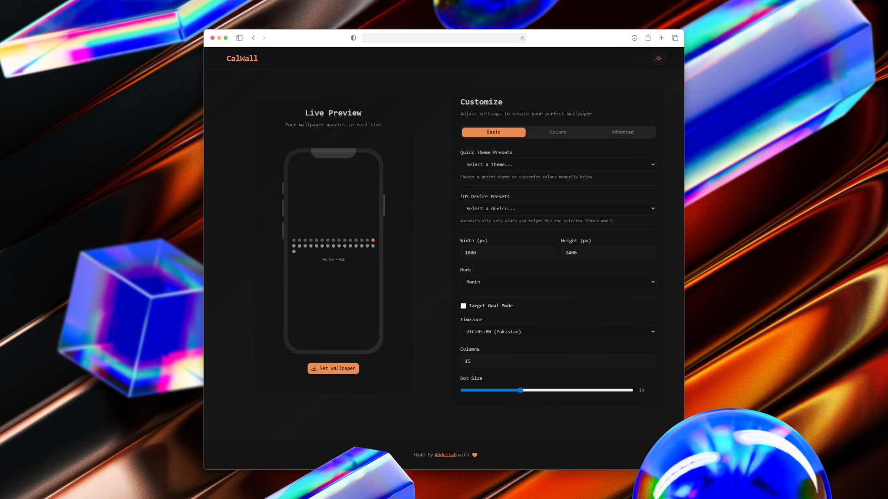
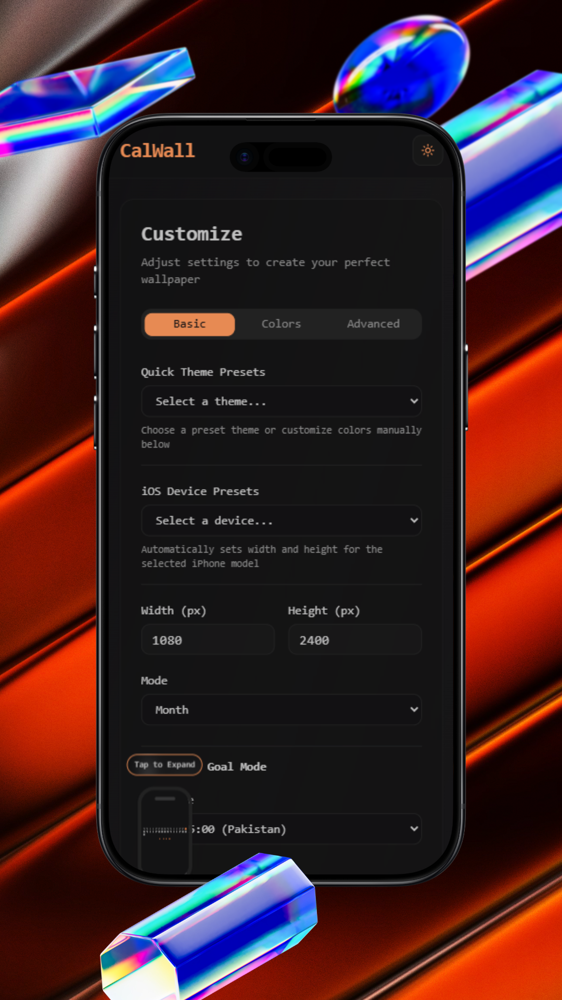
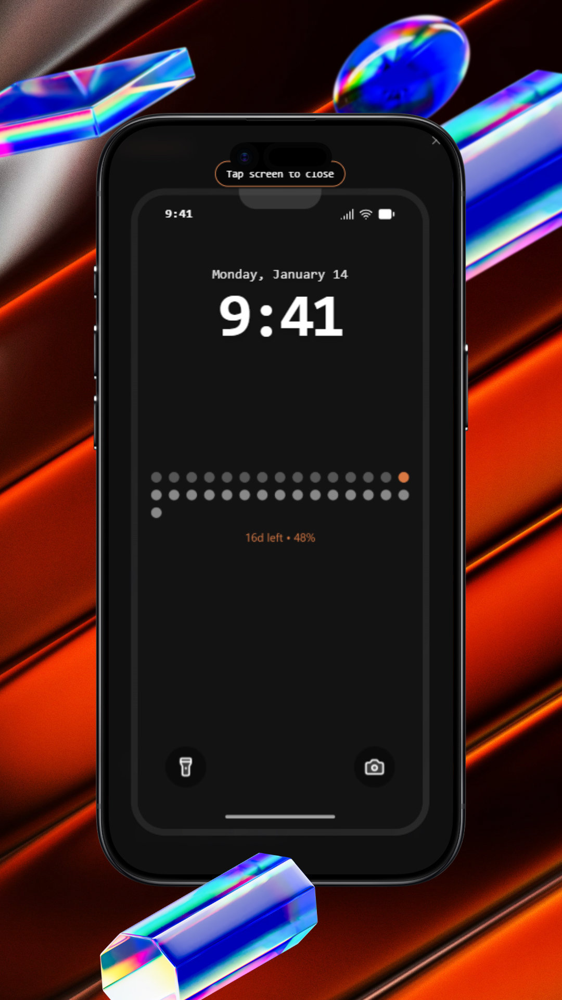

#  CalWall Studio

CalWall Studio is a sophisticated web application designed for generating and customizing dynamic, calendar-based wallpapers. It combines a powerful React-based frontend for real-time preview and customization with a robust Node.js backend for high-quality image generation using Canvas.

## 📖 Overview
CalWall Studio simplifies the creation of aesthetic, data-driven wallpapers. Whether you want to track the year's progress, visualize the days left, or simply have a beautiful, auto-updating calendar on your lock screen, CalWall provides the tools to design and generate it instantly. The application bridges the gap between static design and dynamic data, offering a seamless "Studio" experience where every tweak is reflected in real-time.

## 🌟 Features

- **Dynamic Wallpaper Generation**: Create wallpapers that visualize time progress (e.g., year progress, days left).
- **Real-time Preview**: Instantly see changes as you tweak settings in the studio.
- **Customizable Themes**: Choose from various color schemes and layout options.
- **Device Support**: Optimized mainly for mobile devices (iOS lock screen aesthetics).
- **Dashboard & Resume**: (Experimental) Includes a personal dashboard and resume view.

## 📱 Mobile Responsive
CalWall is built with a mobile-first philosophy for the end result, ensuring your wallpapers look stunning on your device.

  
  

## 🛠 Tech Used

### Client (Frontend)
- **Framework**: [React](https://react.dev/) + [Vite](https://vitejs.dev/)
- **Styling**: [TailwindCSS v4](https://tailwindcss.com/)
- **UI Components**: [Shadcn UI](https://ui.shadcn.com/)
- **State/Logic**: Custom hooks, Context API

### Server (Backend)
- **Runtime**: [Node.js](https://nodejs.org/)
- **Framework**: [Express](https://expressjs.com/)
- **Image Processing**: [Canvas](https://github.com/Automattic/node-canvas)
- **Utilities**: `date-fns`, `dayjs`

## 🤝 Contributing & Open Sourcing
This project is open-source and we welcome contributions from the community!

1.  **Fork the repository**.
2.  **Create a new branch** (`git checkout -b feature/YourFeature`).
3.  **Commit your changes** (`git commit -m 'Add some feature'`).
4.  **Push to the branch** (`git push origin feature/YourFeature`).
5.  **Open a Pull Request**.

Please ensure your code moves the project forward and follows the existing style guidelines.
